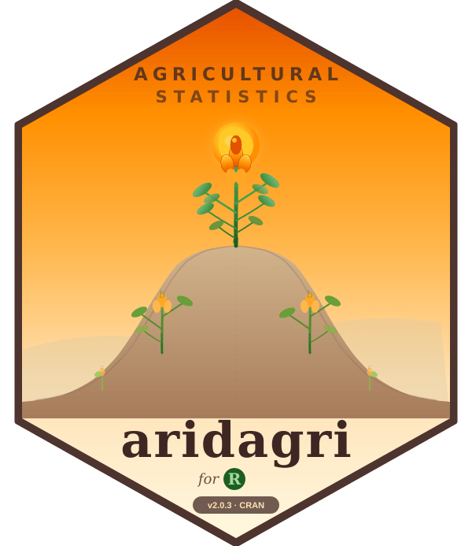

# aridagri 

<!-- badges: start -->
[](https://cran.r-project.org/)
[](https://www.gnu.org/licenses/gpl-3.0)
[](https://cran.r-project.org/package=aridagri)
[](https://doi.org/10.32614/CRAN.package.aridagri)
<!-- badges: end -->

## Comprehensive Statistical Tools for Agricultural Research

**aridagri** is a comprehensive R package providing **35+ functions** for statistical analysis in agricultural research, with special focus on experimental design analysis and agronomic calculations.

### Key Features

- 🔬 **Complete ANOVA Suite**: All experimental designs with proper error terms
- 📊 **Multiple Post-Hoc Tests**: LSD, Duncan, Tukey, SNK, Scheffé, Bonferroni, Dunnett
- 📈 **Stability Analysis**: 7 methods (Eberhart-Russell, AMMI, Finlay-Wilkinson, Shukla, Wricke, CV, Superiority)
- 🌡️ **Thermal Indices**: GDD, HTU, PTU, Heat Use Efficiency
- 🌱 **Crop Growth Analysis**: CGR, RGR, NAR, LAI
- 📋 **Publication-Ready Output**: Formatted tables with SE, CD, CV

---

## Installation

```r
# Install devtools if needed
install.packages("devtools")

# Install aridagri from GitHub
devtools::install_github("lalitrolaniya/aridagri")
```

---

## Function Overview

### Experimental Design ANOVA (17 Functions)

| Function | Design |
|----------|--------|
| `anova_crd()` | Completely Randomized Design |
| `anova_rbd()` | Randomized Block Design |
| `anova_rbd_pooled()` | Pooled RBD (Multi-Environment) |
| `anova_latin()` | Latin Square Design |
| `anova_factorial()` | Two-Factor Factorial |
| `anova_factorial_3way()` | Three-Factor Factorial |
| `anova_spd()` | Split Plot Design |
| `anova_spd_ab_main()` | SPD with (A×B) in Main Plot |
| `anova_spd_c_main_ab_sub()` | SPD with C Main, (A×B) Sub |
| `anova_spd_ab_cd()` | SPD with (A×B) Main, (C×D) Sub |
| `anova_spd_pooled()` | Pooled Split Plot Design |
| `anova_sspd()` | Split-Split Plot Design |
| `anova_sspd_pooled()` | Pooled SSPD |
| `anova_strip()` | Strip Plot Design |
| `anova_augmented()` | Augmented Block Design |
| `anova_alpha_lattice()` | Alpha Lattice Design |

### Post-Hoc Tests (8 Methods)

All available via `perform_posthoc()`:
- Fisher's LSD
- Duncan's Multiple Range Test (DMRT)
- Tukey's HSD
- Student-Newman-Keuls (SNK)
- Scheffé's Test
- Bonferroni Correction
- Dunnett's Test (vs Control)

### Agronomic Analysis (6 Functions)

| Function | Analysis |
|----------|----------|
| `stability_analysis()` | 7-method stability analysis |
| `thermal_indices()` | GDD, HTU, PTU, HUE |
| `crop_growth_analysis()` | CGR, RGR, NAR, LAI |
| `harvest_index()` | HI and partitioning |
| `yield_gap_analysis()` | Yield gap calculations |
| `economic_indices()` | B:C ratio, net returns |

### Statistical Analysis (4 Functions)

| Function | Analysis |
|----------|----------|
| `correlation_analysis()` | Correlation matrix with significance |
| `pca_analysis()` | Principal Component Analysis |
| `path_analysis()` | Path coefficients |
| `sem_analysis()` | Structural Equation Modeling |

### Nutrient Analysis (3 Functions)

| Function | Analysis |
|----------|----------|
| `nue_calculate()` | Nutrient Use Efficiency indices |
| `nutrient_response()` | Response curve analysis |
| `economic_analysis()` | Economic optimum |

---

## Quick Examples

### Split-Split Plot Design ANOVA

```r
library(aridagri)

data <- expand.grid(
  rep = 1:3,
  irrigation = c("I1", "I2", "I3"),
  variety = c("V1", "V2"),
  nitrogen = c("N0", "N40", "N80")
)
data$yield <- rnorm(nrow(data), 1200, 150)

result <- anova_sspd(data, 
                     response = "yield",
                     main_plot = "irrigation",
                     sub_plot = "variety",
                     sub_sub_plot = "nitrogen",
                     replication = "rep")
```

### Stability Analysis (7 Methods)

```r
data <- expand.grid(
  variety = paste0("V", 1:10),
  location = paste0("L", 1:5),
  rep = 1:3
)
data$yield <- rnorm(nrow(data), 1200, 200)

stability_analysis(data, 
                   genotype = "variety",
                   environment = "location",
                   replication = "rep",
                   trait = "yield",
                   method = "all")
```

---

## Unique Features

1. **First R package** with ALL split plot design variations
2. **Complete SE/CD calculations** for every comparison type
3. **7 stability analysis methods** in single function
4. **Integrated thermal indices** (GDD, HTU, PTU, HUE)
5. **Crop growth analysis** (CGR, RGR, NAR, LAI)
6. **Publication-ready formatted output**

---

## Citation

```
Rolaniya, L.K., Jat, R.L., Punia, M., and Choudhary, R.R. (2026). aridagri: 
Comprehensive Statistical Tools for Agricultural Research. 
R package version 2.0.3. https://github.com/lalitrolaniya/aridagri
```

---

## Authors

**Lalit Kumar Rolaniya** (Maintainer)
Scientist (Agronomy)
ICAR-Indian Institute of Pulses Research, Regional Centre, Bikaner, Rajasthan-334006, India
ORCID: [0000-0001-8908-1211](https://orcid.org/0000-0001-8908-1211)

**Ram Lal Jat**
Senior Scientist (Agronomy)
ICAR-Indian Institute of Pulses Research, Regional Centre, Bikaner, Rajasthan-334006, India
ORCID: [0009-0003-4339-0555](https://orcid.org/0009-0003-4339-0555)

**Monika Punia**
Scientist (Genetics & Plant Breeding)
ICAR-Indian Institute of Pulses Research, Regional Centre, Bikaner, Rajasthan-334006, India
ORCID: [0009-0002-0294-6767](https://orcid.org/0009-0002-0294-6767)

**Raja Ram Choudhary**
Scientist (Agronomy)
ICAR-Indian Institute of Groundnut Research, Regional Research Station, Bikaner, Rajasthan-334006, India

---

## Acknowledgments

The authors gratefully acknowledge **ICAR-Indian Institute of Pulses Research, Kanpur** for providing necessary support and infrastructure for the development of this package.

---

## License

GPL-3

---

## Contributing

Contributions are welcome! Please feel free to submit issues or pull requests.
