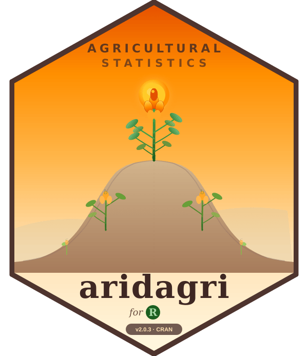

# aridagri 

<!-- badges: start -->
[](https://cran.r-project.org/)

[](https://cran.r-project.org/package=aridagri)
[](https://doi.org/10.32614/CRAN.package.aridagri)
[](https://cran.r-project.org/package=aridagri)
<!-- badges: end -->

## Comprehensive Statistical Tools for Agricultural Research

**aridagri** is an R package providing **33 functions** for statistical analysis
in agricultural research, with a focus on experimental design analysis and
agronomic calculations. It is written in base R with no hard dependencies.

### Key Features

- **ANOVA suite** covering all common field designs
- **Post-hoc tests**: LSD, Duncan (DMRT), Tukey, SNK, Scheffe, Bonferroni, Dunnett
- **Stability analysis**: 7 methods (Eberhart-Russell, AMMI, Finlay-Wilkinson, Shukla, Wricke, CV, Lin-Binns) with an integrated ranking
- **Thermal indices**: GDD, HTU, PTU, Heat Use Efficiency
- **Crop growth analysis**: CGR, RGR, NAR
- **Publication-ready output**: formatted tables with SE, CD, CV

---

## Installation

```r
# From CRAN
install.packages("aridagri")

# Development version from GitHub
# install.packages("remotes")
remotes::install_github("lalitrolaniya/aridagri")
```

---

## Function Overview

### Experimental Design ANOVA (16 functions)

| Function | Design |
|----------|--------|
| `anova_crd()` | Completely Randomized Design |
| `anova_rbd()` | Randomized Block Design |
| `anova_rbd_pooled()` | Pooled RBD (multi-environment) |
| `anova_latin()` | Latin Square Design |
| `anova_factorial()` | Two-Factor Factorial |
| `anova_factorial_3way()` | Three-Factor Factorial |
| `anova_spd()` | Split-Plot Design |
| `anova_spd_ab_main()` | SPD with (A x B) in main plot |
| `anova_spd_c_main_ab_sub()` | SPD with C main, (A x B) sub |
| `anova_spd_ab_cd()` | SPD with (A x B) main, (C x D) sub |
| `anova_spd_pooled()` | Pooled Split-Plot Design |
| `anova_sspd()` | Split-Split-Plot Design |
| `anova_sspd_pooled()` | Pooled SSPD |
| `anova_strip()` | Strip-Plot Design |
| `anova_augmented()` | Augmented Block Design |
| `anova_alpha_lattice()` | Alpha Lattice Design |

### Stability, agronomic, statistical and nutrient functions

| Function | Analysis |
|----------|----------|
| `stability_analysis()` | 7 stability methods with integrated ranking |
| `thermal_indices()` | GDD, HTU, PTU, HUE |
| `crop_growth_analysis()` | CGR, RGR, NAR |
| `harvest_index()` | Harvest index and partitioning |
| `yield_gap_analysis()` | Yield gap calculations |
| `economic_indices()` | B:C ratio, net returns |
| `correlation_analysis()` | Correlation matrix with significance |
| `pca_analysis()` | Principal Component Analysis |
| `path_analysis()` | Path coefficient analysis |
| `sem_analysis()` | Structural Equation Modeling |
| `nue_calculate()` | Nutrient Use Efficiency indices |
| `nutrient_response()` | Response curve and economic optimum |
| `economic_analysis()` | Gross/net return, B:C ratio |

### Post-hoc, diagnostics and utilities

| Function | Purpose |
|----------|---------|
| `perform_posthoc()` | Post-hoc comparisons (7 methods) |
| `check_assumptions()` | Normality, homogeneity, independence, outliers |
| `arid_plot()` | Base-graphics plots for ANOVA, correlation and stability objects |
| `export_results()` | Export results to Excel or CSV |

---

## Usage

Every function is called with the data frame first, then the column names as
character strings. Set `verbose = FALSE` to suppress the printed report and
just capture the returned object.

### Analysis of variance

```r
library(aridagri)

## Completely Randomized Design
crd <- data.frame(
  treatment = factor(rep(c("T1", "T2", "T3", "T4"), each = 4)),
  yield     = c(20, 22, 19, 21,  25, 27, 24, 26,
                30, 32, 29, 31,  28, 30, 27, 29)
)

res <- anova_crd(crd, response = "yield", treatment = "treatment")

## the returned object holds the table, means and statistics
res$anova_table
res$treatment_means
res$cv

## Randomized Block Design
anova_rbd(data, response = "yield", treatment = "variety", block = "block")

## Two-factor factorial
anova_factorial(data, response = "yield", factor1 = "nitrogen", factor2 = "variety")

## Split-plot design
anova_spd(data, response = "yield",
          main_plot = "irrigation", sub_plot = "variety", replication = "rep")
```

### Post-hoc comparisons

There are two equivalent ways to run a post-hoc test.

```r
## Option 1: inline, as part of the ANOVA call
anova_crd(crd, "yield", "treatment", posthoc = "tukey")

## Option 2: standalone, on a fitted aov() model
model <- aov(yield ~ treatment, data = crd)
perform_posthoc(model, crd, response = "yield", treatment = "treatment",
                posthoc = "tukey")
```

Valid method names are `"lsd"`, `"duncan"`, `"tukey"`, `"snk"`, `"scheffe"`,
`"dunnett"`, `"bonferroni"`, or `"all"`. Dunnett compares every level against
the **first** factor level as the control; there is no separate `control`
argument, so order the treatment factor with the control first if needed.

### Assumption checks

```r
model <- aov(yield ~ treatment, data = crd)
check_assumptions(model)   # Shapiro-Wilk, Bartlett, Durbin-Watson, outliers
```

### Split-Split-Plot Design

```r
data <- expand.grid(
  rep        = 1:3,
  irrigation = c("I1", "I2", "I3"),
  variety    = c("V1", "V2"),
  nitrogen   = c("N0", "N40", "N80")
)
data$yield <- rnorm(nrow(data), 1200, 150)

anova_sspd(data,
           response     = "yield",
           main_plot    = "irrigation",
           sub_plot     = "variety",
           sub_sub_plot = "nitrogen",
           replication  = "rep")
```

### Stability analysis (7 methods)

```r
data <- expand.grid(
  variety  = paste0("V", 1:10),
  location = paste0("L", 1:5),
  rep      = 1:3
)
data$yield <- rnorm(nrow(data), 1200, 200)

stability_analysis(data,
                   genotype    = "variety",
                   environment = "location",
                   replication = "rep",
                   trait       = "yield",
                   method      = "all")
```

### Correlation, PCA and visualization

```r
df <- data.frame(
  yield   = rnorm(30, 1200, 150),
  pods    = rnorm(30, 50, 6),
  biomass = rnorm(30, 3500, 400)
)

cor_res <- correlation_analysis(df, method = "pearson")
pca_res <- pca_analysis(df, scale = TRUE)

## arid_plot() draws factor/treatment means for any ANOVA design,
## a heatmap for a correlation object, and a ranking for a stability object
arid_plot(res)
arid_plot(cor_res)
```

### Exporting results

```r
export_results(res, "results.xlsx")                  # Excel (default)
export_results(res, "results.csv", format = "csv")   # CSV
```

---

## Unique Features

1. All split-plot design variations in one package
2. SE and CD reported for each comparison type
3. Seven stability analysis methods in a single function
4. Thermal indices (GDD, HTU, PTU, HUE) and crop growth analysis (CGR, RGR, NAR)
5. Base-R implementation with no hard dependencies

---

## Citation

```
Rolaniya, L.K., Jat, R.L., Punia, M., and Choudhary, R.R. (2026). aridagri:
Comprehensive Statistical Tools for Agricultural Research.
R package version 2.0.4. https://github.com/lalitrolaniya/aridagri
```

---

## Authors

**Lalit Kumar Rolaniya** (Maintainer)
Scientist (Agronomy)
ICAR-Indian Institute of Pulses Research, Regional Centre, Bikaner, Rajasthan-334006, India
ORCID: [0000-0001-8908-1211](https://orcid.org/0000-0001-8908-1211)

**Ram Lal Jat**
Senior Scientist (Agronomy)
ICAR-Indian Institute of Pulses Research, Regional Centre, Bikaner, Rajasthan-334006, India
ORCID: [0009-0003-4339-0555](https://orcid.org/0009-0003-4339-0555)

**Monika Punia**
Scientist (Genetics & Plant Breeding)
ICAR-Indian Institute of Pulses Research, Regional Centre, Bikaner, Rajasthan-334006, India
ORCID: [0009-0002-0294-6767](https://orcid.org/0009-0002-0294-6767)

**Raja Ram Choudhary**
Scientist (Agronomy)
ICAR-Indian Institute of Groundnut Research, Regional Research Station, Bikaner, Rajasthan-334006, India

---

## License

GPL-3

---

## Contributing

Contributions are welcome. Please submit issues or pull requests on GitHub.
